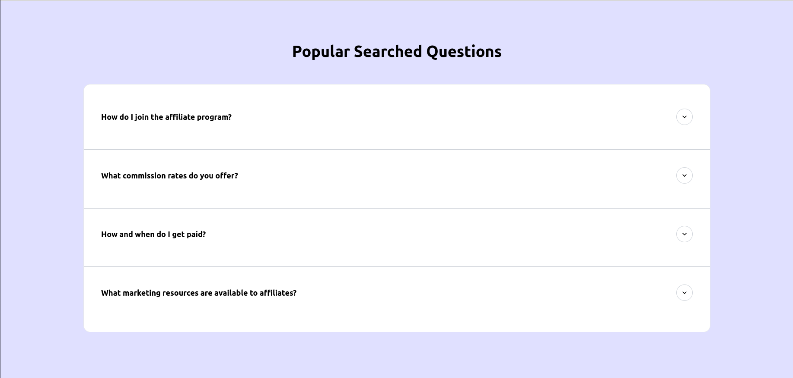

# Final Assignment 

## Description
This application provides a help center and blog page. It fetches FAQ data from a local JSON file and renders it on the screen. The application features blog categories and allows users to explore various blog posts. State management for blogs is handled using Redux slices to maintain state across different pages.

## Table of Contents
- [Installation](#installation)
- [Usage](#usage)
- [Features](#features)
- [Why This Approach](#why-this-approach)
- [Local Data Fetching](#local-data-fetching)
- [Using Mock API](#using-mock-api)
- [Contact](#contact)

## Installation
1. Clone the repository:
  
   git clone https://github.com/sanjaykumar0324/final-assignment.git

2. Navigate to the project directory
3. Install dependencies using "npm install"

## Usage
 To start the application, run: npm run dev
 Then navigate to http://localhost:5173 in  browser to view the help center and blogs.

## Features
1. FAQ section rendered from local JSON data.
2. Blog categories and posts available for browsing.
3. State management for blogs using Redux slices.
4. Responsive design for optimal viewing across devices.
5. Engaging animations for improved user experience.
6. Progressive Web App (PWA) capabilities for offline access and a native app-like experience.
7. Redirects to a "Not Found" page for any invalid navigation attempts.

## Approach for data handling

1. **State Management**: Redux is used specifically for managing the state of blogs because this data is accessed across multiple pages and components. It ensures efficient state sharing and updates without unnecessary prop drilling. In contrast, the FAQ section does not require Redux, as it is only displayed in one place and can be easily managed with local state.

2. **Rendering Additional Data**: Other components, such as the footer, help desk cards, and service cards, are rendered using arrays from local data files. This approach allows for easy updates and management of these elements, enhancing modularity and maintainability.

## Local Data Fetching
The application fetches data from local JSON files located in the public/data folder. This approach is used to avoid issues with expiring mock API links.

## Using Mock API
If you want to test with a mock API:

1. Go to [MockAPI](https://mockapi.io)
2. Paste the JSON data into the provided field and generate a link.
3. Replace the existing links in src/redux/slices/categorySlice.js and src/redux/slices/blogSlice.js with  new Mock API URL.

## Contact
For inquiries, please email me at [sanju4232908@gmail.com](mailto:sanju4232908@gmail.com).

## Screenshots

Here are some screenshots of the application:

